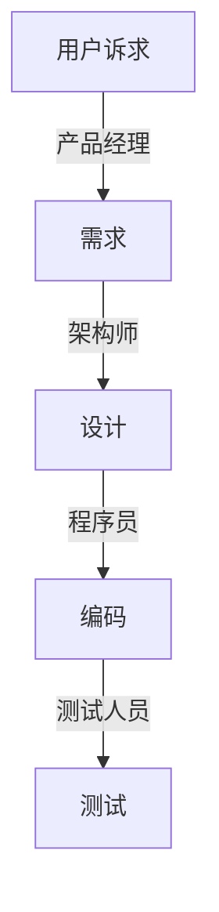
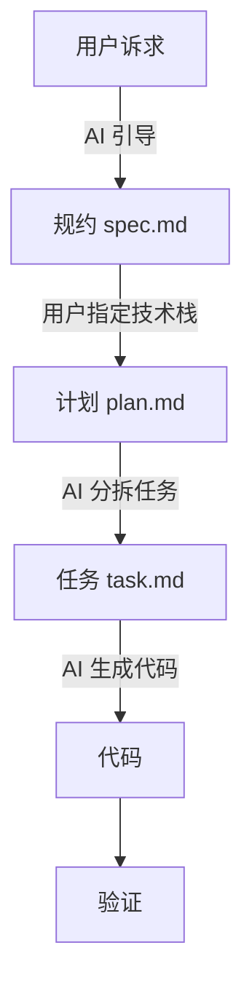
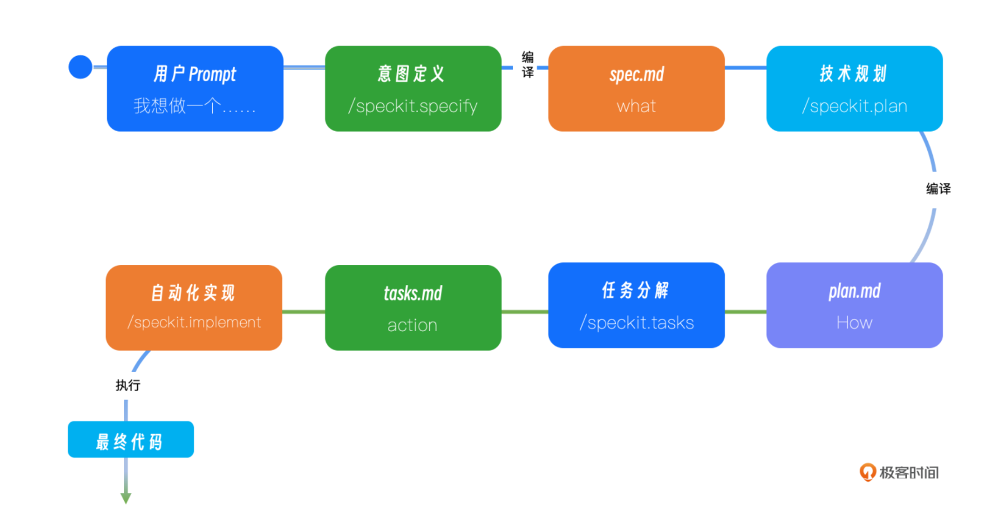
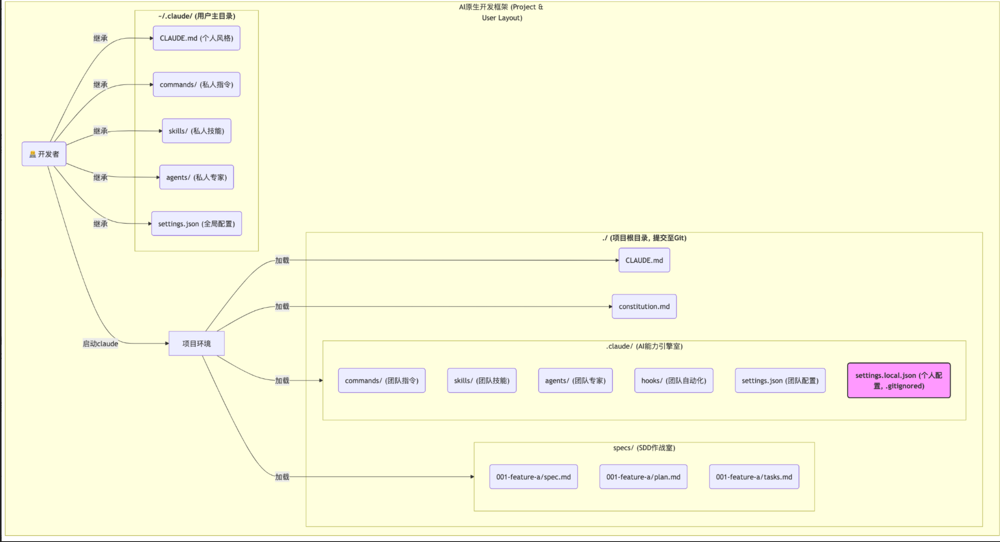

## 趋势

### 传统开发

```mermaid
flowchart
  S[用户诉求] -->|产品经理| A[需求]
  A -->|架构师| B[设计]
  B -->|程序员| C[编码]
  C -->|测试人员| D[测试]
```

### AI 开发

```mermaid
flowchart
  S[用户诉求] -->|AI 引导| B[规约 spec.md]
  B --> |用户指定技术栈| C[计划 plan.md]
  C --> |AI 分拆任务| D[任务 task.md]
  D --> |AI 生成代码| E[代码]
  E --> F[验证]
```

## 工具选择

Claude Code + 智谱 GLM (国内模型)

## [[Claude_Code_功能介绍.md]]

## [[Claude_Code_实战演练.md]]

